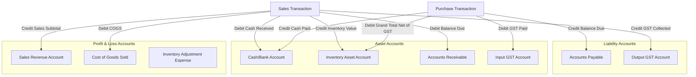
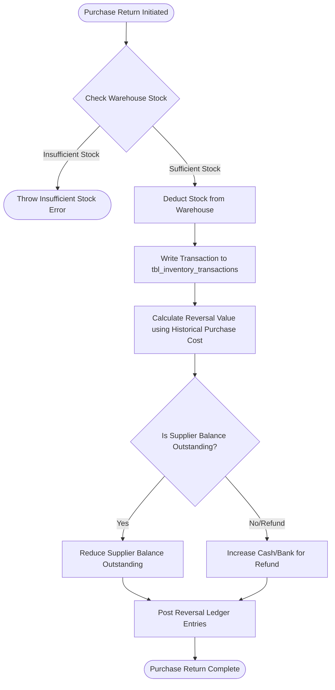
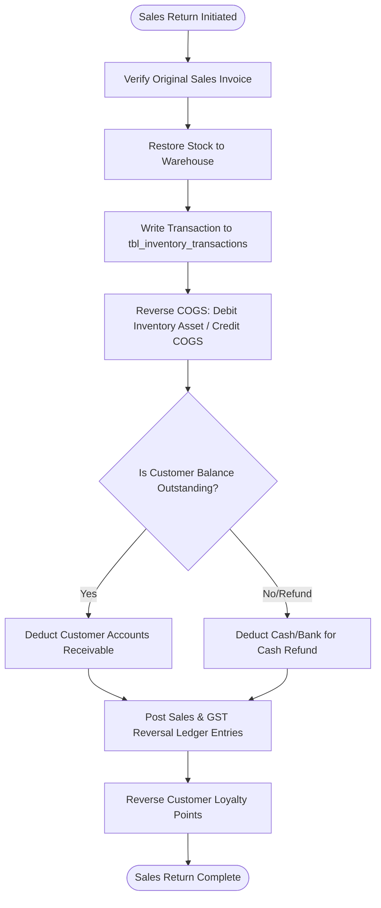
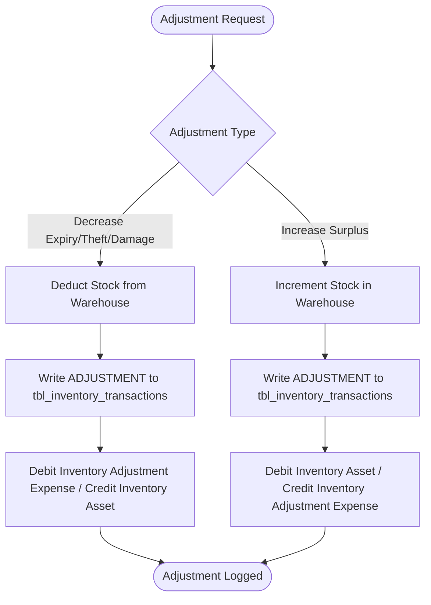
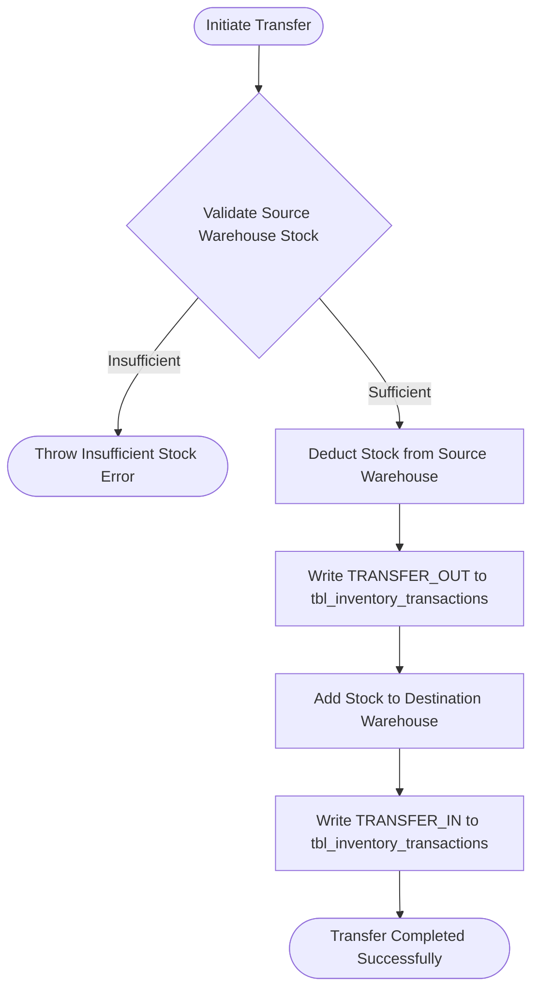

# BizNext Enterprise ERP Specification: Product, Purchase, Inventory, Sales & Accounting Workflows

This document serves as the official Enterprise ERP Solution Architecture and Technical Specification for the BizNext platform. It defines the logical schemas, data flows, double-entry accounting rules, validation constraints, and database transaction boundaries necessary to support POS, Retail, Wholesale, Distribution, and Multi-warehouse business models.

---

## 1. Core Data Models & Schema Design

### 1.1 Product Master Schema
Products are tracked using unique identifiers, multi-tiered pricing, and configurable cost systems.

*   **Key Fields**:
    *   `id`: Unique Auto-increment Primary Key.
    *   `name`: Product name.
    *   `sku`: Stock Keeping Unit (Unique).
    *   `barcode`: Barcode (UPC/EAN) (Unique).
    *   `description`: Text details.
    *   `category_id`: Foreign Key referencing Category.
    *   `purchase_cost`: Current cost price of the product (calculated via the active costing method).
    *   `selling_price` / `wholesale_price` / `dealer_price`: Outward pricing tiers.
    *   `stock`: Total physical stock across all warehouses.
    *   `min_stock`: Safety stock threshold.
    *   `unit`: Unit of measure (e.g., pcs, kg, box).
    *   `gst_percent`: Applicable Goods and Services Tax percentage.
    *   `is_active`: Boolean flag indicating if the product is active.

### 1.2 Dedicated Inventory Transaction Log (`tbl_inventory_transactions`)
Every stock movement (inward, outward, internal, or adjustment) must generate an immutable log record.

| Field | Data Type | Description |
| :--- | :--- | :--- |
| `transaction_id` | INT (PK) | Auto-increment unique identifier. |
| `product_id` | INT (FK) | Reference to the Product master. |
| `warehouse_id` | INT (FK) | Reference to the Warehouse where the transaction occurred. |
| `transaction_type` | VARCHAR | `PURCHASE`, `SALE`, `PURCHASE_RETURN`, `SALES_RETURN`, `ADJUSTMENT`, `TRANSFER_IN`, `TRANSFER_OUT`, `OPENING_STOCK` |
| `reference_number` | VARCHAR | Document number (e.g., Invoice #, Bill #, Adjustment #, Transfer #). |
| `quantity` | DECIMAL | Quantity moved (always positive; direction is determined by transaction type). |
| `unit_cost` | DECIMAL | Cost price of the item for this specific transaction. |
| `opening_stock` | DECIMAL | Stock balance immediately prior to this transaction. |
| `closing_stock` | DECIMAL | Stock balance immediately after this transaction. |
| `created_by` | INT (FK) | Reference to the User who executed the transaction. |
| `created_date` | DATETIME | Timestamp of the execution. |
| `remarks` | TEXT | Audit remarks explaining the movement. |

---

## 2. Double-Entry Accounting Architecture

BizManager operates on standard double-entry ledger principles. All transactions must post balanced Debit (DR) and Credit (CR) journal entries.

### 2.1 Chart of Accounts (CoA) Segments
*   **Assets**: Inventory Asset Account, Accounts Receivable (Customers), Cash Account, Bank Account, Input GST.
*   **Liabilities**: Accounts Payable (Suppliers), Output GST.
*   **Equity**: Retained Earnings.
*   **Revenue**: Sales Revenue.
*   **Expenses**: Cost of Goods Sold (COGS), Inventory Adjustments (Shrinkage/Write-off).

### 2.2 Double Entry Accounting Flow Diagram



---

## 3. Detailed Business Workflows & Ledger Entries

### 3.1 Purchase Workflow (Inward Stock)
When buying inventory, the system must separate the tax (Input GST) from the physical inventory cost value.

#### Steps:
1. Validate invoice uniqueness (`bill_no` + `supplier_id`).
2. Insert Purchase Header into `tbl_purchases`.
3. Loop through purchase items:
    * Insert into `tbl_purchase_items`.
    * Recalculate Product `purchase_cost` using the active Costing Method (see Section 4).
    * Increment Product stock at the selected warehouse.
    * Write record to `tbl_inventory_transactions`.
4. Update Supplier Balance (Accounts Payable) by the `balance_due`.
5. Post General Ledger journal entries.
6. Verify and deduct funds from the Cash/Bank account for `paid_amount` (throw exception if insufficient funds).

#### Accounting Entry Example:
A business purchases 100 units of Product A at $10 each, with a 10% GST rate. Total subtotal = $1,000, GST = $100, Grand Total = $1,100. They pay $500 cash, with $600 remaining as accounts payable.

| Account Name | Debit (DR) | Credit (CR) | Account Category |
| :--- | :--- | :--- | :--- |
| **Inventory Asset Account** | $1,000.00 | | Asset |
| **Input GST Account** | $100.00 | | Asset |
| **Cash/Bank Account** | | $500.00 | Asset (Decrease) |
| **Accounts Payable (Supplier)** | | $600.00 | Liability (Increase) |

---

### 3.2 Purchase Return Workflow
Used to return defective or excess inventory back to a supplier. **Deleting purchases directly is strictly prohibited in production** if stock has already been partially consumed or sold.



#### Steps:
1. Verify returning stock is physically available in the selected warehouse.
2. Calculate return value using the historical cost of the original purchase.
3. Deduct stock from the warehouse.
4. Log transaction to `tbl_inventory_transactions`.
5. Reduce Supplier Outstanding Balance by the return value (or record a Cash Refund if the purchase was fully prepaid).
6. Post Ledger reversal entries.

#### Accounting Entry Example:
Returning $200 worth of Net Inventory (originally subject to 10% GST, Total value = $220).

| Account Name | Debit (DR) | Credit (CR) | Account Category |
| :--- | :--- | :--- | :--- |
| **Accounts Payable (Supplier)** / **Cash/Bank** | $220.00 | | Liability (Decrease) / Asset (Increase) |
| **Inventory Asset Account** | | $200.00 | Asset (Decrease) |
| **Input GST Account** | | $20.00 | Asset (Decrease) |

---

### 3.3 Sales Workflow (POS / B2B Sale)
Every sales transaction must record revenue, output tax liability, account receivable, cash collection, and simultaneously calculate and post Cost of Goods Sold (COGS).

#### Steps:
1. Validate inventory availability (unless configurable negative stock is enabled).
2. Insert Sales Header into `tbl_sales`.
3. Loop through invoice items:
    * Fetch product's current calculated cost price (COGS baseline).
    * Insert record into `tbl_sale_items` with the snapshotted cost price.
    * Deduct product stock from the warehouse.
    * Write record to `tbl_inventory_transactions`.
4. Update Customer Outstanding Balance (Accounts Receivable) by the `balance_due`.
5. Post Ledger entries for Revenue & Asset collections.
6. Post Ledger entries for Cost of Goods Sold (COGS).
7. Increment customer loyalty points.

#### Accounting Entry Example:
A customer buys goods for a selling price of $1,500 with a 10% GST rate (Total Invoice = $1,650). The customer pays $1,000 cash, with $650 outstanding. The inventory value (cost price) of these items was $900.

**Revenue & Taxation Journal:**
| Account Name | Debit (DR) | Credit (CR) | Account Category |
| :--- | :--- | :--- | :--- |
| **Cash/Bank Account** | $1,000.00 | | Asset (Increase) |
| **Accounts Receivable (Customer)** | $650.00 | | Asset (Increase) |
| **Sales Revenue Account** | | $1,500.00 | Revenue |
| **Output GST Account** | | $150.00 | Liability (Increase) |

**Cost of Goods Sold (COGS) Journal:**
| Account Name | Debit (DR) | Credit (CR) | Account Category |
| :--- | :--- | :--- | :--- |
| **Cost of Goods Sold (COGS)** | $900.00 | | Expense (Increase) |
| **Inventory Asset Account** | | $900.00 | Asset (Decrease) |

> **Why we snapshot cost during sales**: Snapshotting the product cost price at the exact moment of sale guarantees that historical financial reports (Profit & Loss) remain accurate. Even if the inventory's current unit cost fluctuates tomorrow due to new supplier purchases, the profit margins calculated for past transactions remain tied to their true historical cost.

---

### 3.4 Sales Return Workflow
Handles customer return of products. It restores inventory assets and reverses revenue and tax logs.



#### Steps:
1. Retrieve original Sales Invoice.
2. Increment inventory stock back at the designated warehouse.
3. Log transaction to `tbl_inventory_transactions`.
4. Reverse the Cost of Goods Sold value based on the original snapshotted sale price.
5. Deduct Customer Receivable (or refund Cash/Bank).
6. Reverse Revenue and Output GST ledger entries.
7. Deduct customer loyalty points.

#### Accounting Entry Example:
Reversing a sale of $300 worth of net items (10% GST, Total Invoice value = $330) with an original cost price of $180.

**Revenue & Taxation Reversal Journal:**
| Account Name | Debit (DR) | Credit (CR) | Account Category |
| :--- | :--- | :--- | :--- |
| **Sales Revenue Account** | $300.00 | | Revenue (Decrease) |
| **Output GST Account** | $30.00 | | Liability (Decrease) |
| **Accounts Receivable (Customer)** / **Cash/Bank** | | $330.00 | Asset (Decrease) |

**COGS Reversal Journal:**
| Account Name | Debit (DR) | Credit (CR) | Account Category |
| :--- | :--- | :--- | :--- |
| **Inventory Asset Account** | $180.00 | | Asset (Increase) |
| **Cost of Goods Sold (COGS)** | | $180.00 | Expense (Decrease) |

---

### 3.5 Inventory Adjustment Workflow (Shrinkage, Expiry, Theft, Counting Corrections)
Enables corrections to physical stock. Adjustments require writing off value as an expense or adjusting inventory up due to surplus discoveries.



#### Accounting Entry Example (Stock Write-off for Damage/Theft/Expiry):
Writing off damaged inventory valued at $500.

| Account Name | Debit (DR) | Credit (CR) | Account Category |
| :--- | :--- | :--- | :--- |
| **Inventory Adjustment Expense Account** | $500.00 | | Expense |
| **Inventory Asset Account** | | $500.00 | Asset (Decrease) |

---

### 3.6 Warehouse Transfer Workflow
Moving items between different warehouses in a multi-location system. This action only moves stock location, resulting in **zero net financial impact** on the General Ledger.



#### Steps:
1. Check stock availability in the source warehouse.
2. Deduct stock from the source warehouse.
3. Log a `TRANSFER_OUT` record in `tbl_inventory_transactions` referencing the source warehouse.
4. Add stock to the destination warehouse.
5. Log a `TRANSFER_IN` record in `tbl_inventory_transactions` referencing the destination warehouse.

---

### 3.7 Sale Cancellation Workflow
Used to void a sale in its entirety. It reverses all financial, stock, customer balance, and loyalty impacts.

#### Steps:
1. Verify the original sale status.
2. Restore stock to the designated warehouse.
3. Log transaction to `tbl_inventory_transactions`.
4. Reverse the customer's outstanding balance (Accounts Receivable) or reverse the bank account balance (if a refund was processed).
5. Post ledger reversals for Revenue, Output GST, and Cost of Goods Sold.
6. Reverse loyalty points granted.

---

## 4. Cost Price Calculation Methods

BizManager provides a configurable inventory costing system to ensure accurate balance sheets.

### 4.1 Weighted Average Cost (WAC) - *Recommended*
Every time a new purchase is recorded, the unit cost is re-calculated as follows:

$$\text{New WAC} = \frac{(\text{Current Stock} \times \text{Current WAC}) + (\text{New Purchase Qty} \times \text{New Purchase Unit Cost})}{\text{Current Stock} + \text{New Purchase Qty}}$$

#### Example:
*   Current Stock = 50 units @ $10.00 WAC (Valued at $500.00).
*   New Purchase = 100 units @ $12.00 unit cost (Valued at $1,200.00).
*   New WAC = $\frac{\$500.00 + \$1,200.00}{50 + 100} = \frac{\$1,700.00}{150} = \$11.33$ per unit.

### 4.2 First-In, First-Out (FIFO)
Stock batches are tracked individually in the database. During sales, inventory is consumed from the oldest available batch. COGS is calculated based on the historical cost of that specific batch.

### 4.3 Last Purchase Cost (LPC)
Inventory cost is set directly to the rate of the last purchase invoice. *Note: For tax compliance in some jurisdictions, WAC or FIFO are preferred.*

---

## 5. Party Balance Formulations

To ensure accounting audits match ledger cards, outstanding customer and supplier balances are calculated using strict historical ledger formulas.

### 5.1 Supplier Balance Formula (Accounts Payable)
The outstanding balance owed to a supplier is computed as:

$$\text{Outstanding Balance} = \text{Previous Outstanding} + \text{Credit Purchases} - \text{Payments Made} - \text{Purchase Returns}$$

### 5.2 Customer Balance Formula (Accounts Receivable)
The outstanding balance owed by a customer is computed as:

$$\text{Outstanding Balance} = \text{Previous Outstanding} + \text{Credit Sales} - \text{Customer Payments} - \text{Sales Returns}$$

---

## 6. System Validations, Controls & Safeguards

To maintain data integrity and prevent fraud or database corruption, the system enforces the following rules at the application and database tiers:

### 6.1 Database Transaction Safety (ACID)
All operations touching inventory, ledgers, accounts, and balances must execute within a database transaction block. 

```text
Begin Transaction
   1. Validate inputs (stock levels, unique invoice numbers, customer limits).
   2. Insert transaction headers (Sales/Purchase/Adjustment).
   3. Loop & insert items.
   4. Update stock levels in tbl_products and tbl_warehouse_stocks.
   5. Log entries in tbl_inventory_transactions.
   6. Write accounting journals to tbl_ledger.
   7. Update Supplier/Customer outstanding balances.
   8. Update Cash/Bank account balances.
Commit Transaction
On Exception:
   Rollback Transaction (revert all changes to original states)
```

### 6.2 Application Validation Rules

*   **Duplicate Prevention**:
    *   Reject duplicate SKUs on product creation.
    *   Reject duplicate Barcodes on product creation.
    *   Reject duplicate invoice numbers (`invoice_no` for sales, `bill_no` + `supplier_id` for purchases).
*   **Sign Checks**:
    *   Reject transactions containing negative quantities or prices.
*   **Relationship Integrity**:
    *   Verify `supplier_id` exists in the database before completing a purchase.
    *   Verify `customer_id` exists in the database before completing a sale.
    *   Verify that the GST tax code or percentage is a valid positive value matching configuration tables.
*   **Purchase Deletion Protection**:
    *   Reject attempts to delete historical purchases directly. The system must enforce entering a **Purchase Return** instead to maintain audit trails.
*   **Cash & Bank Verification**:
    *   Before recording payments, query the cash/bank account balance. If the account balance drops below zero, reject the payment (unless overdraft settings are enabled).
*   **Stock Validation**:
    *   Query physical warehouse stock levels before executing a sale. Show a clear error and block the sale if stock is insufficient, unless the product or business settings explicitly allow negative stock.

---

## 7. Operational Automations

### 7.1 Low Stock Automation Flow
When the stock of a product falls to or below `min_stock`:
1.  **Dashboard Notification**: Flag the item on the administrative dashboard notification panel.
2.  **Purchase Suggestion**: Auto-generate a draft purchase order entry suggesting the quantity needed to reach the maximum stock level.
3.  **Alert Dispatch**: Optionally queue system alerts to send email notifications or WhatsApp notifications to procurement officers.
4.  **Reporting Highlight**: Highlight the product in red inside stock reports.

---

## 8. Audit Logging Specification

Every update, insert, or deletion must log to an immutable audit file or database table:

| Field | Description |
| :--- | :--- |
| `log_id` | Auto-increment PK. |
| `user_id` | ID of user executing the action. |
| `timestamp` | Datetime of the action. |
| `module` | `INVENTORY`, `PURCHASES`, `SALES`, `ACCOUNTING`, `SETTINGS` |
| `action_type` | `INSERT`, `UPDATE`, `DELETE`, `VOID` |
| `record_id` | Key of the modified row. |
| `previous_state` | JSON representation of the row before modification (NULL on insert). |
| `new_state` | JSON representation of the row after modification (NULL on delete). |
| `ip_address` | IP address of the device. |
| `device_info` | User agent or device identifier. |

---

## 9. Required ERP Reports Specification

BizNext must expose the following operational and financial reports:

1.  **Stock Ledger**: Chronological transaction history of stock movements (Opening, Inward, Outward, Closing) for each product.
2.  **Inventory Valuation**: Total inventory valuation calculated at cost price (WAC/FIFO), grouped by category.
3.  **Stock Movement**: Detailed warehouse transfer logs and adjustment records.
4.  **Purchase Register**: List of all purchase bills, filtered by date, supplier, and payment status.
5.  **Sales Register**: List of all sales invoices, filtered by date, customer, payment mode, and salesperson.
6.  **Supplier Outstanding (Accounts Payable Aging)**: Balance aging showing due amounts (0-30 days, 31-60 days, 61-90 days, 90+ days) to suppliers.
7.  **Customer Outstanding (Accounts Receivable Aging)**: Customer dues balance aging.
8.  **GST Reports**:
    *   *Input GST Report*: Taxes paid on purchases (for tax reconciliation).
    *   *Output GST Report*: Taxes collected on sales.
    *   *GST Liability Summary*: Net GST payable/receivable (Output GST - Input GST).
9.  **COGS Report**: Displays cost of goods sold grouped by invoice, item, and category.
10. **Gross Profit Report**: Calculate Profit = (Sales Value - Output GST) - COGS, detailing margin percentage.
11. **Inventory Aging**: Reports how long stock has remained in warehouses (to prevent write-offs).
12. **Dead Stock**: Identifies products with zero sales activity over a defined period (e.g., 90+ days).
13. **Fast Moving Items**: Identifies products with high sales turnover.
14. **Slow Moving Items**: Identifies products with low sales turnover.
15. **Daily Stock Summary**: Snapshot of starting stock, additions, sales, adjustments, and closing stock for the day.
16. **Warehouse Stock Report**: Grid showing product stock levels distributed across different warehouses.
